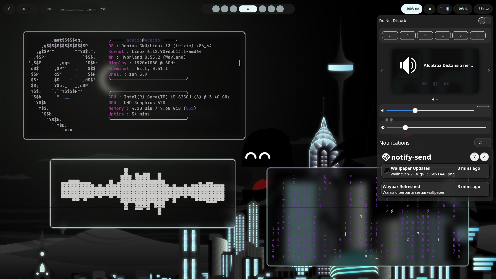
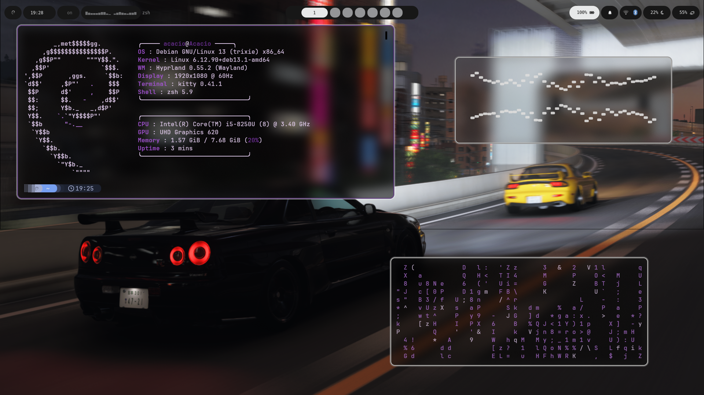
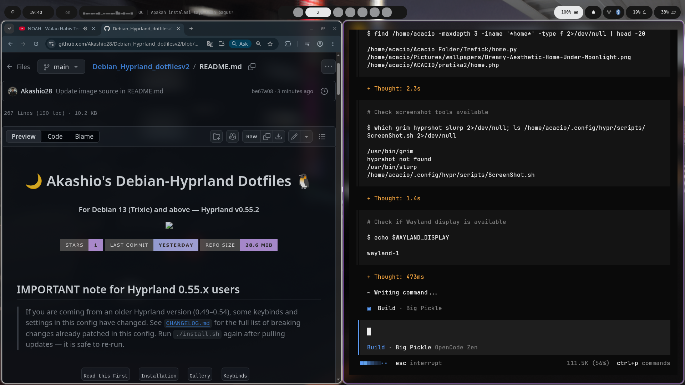
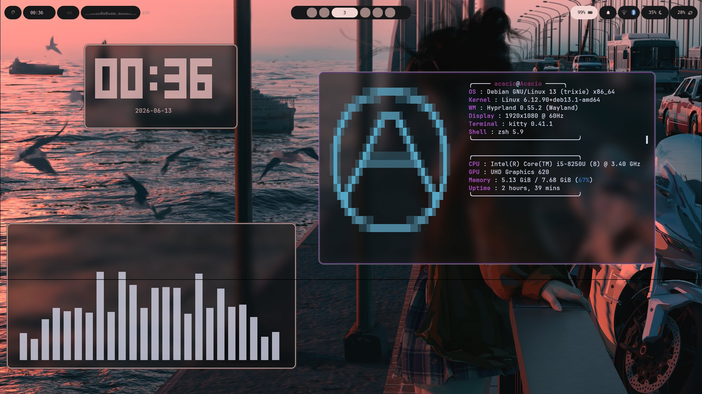
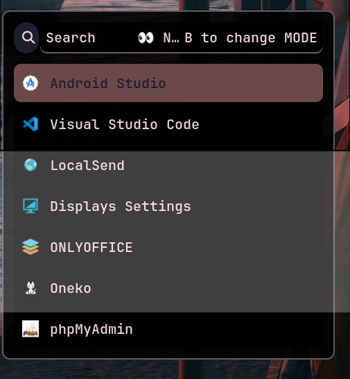
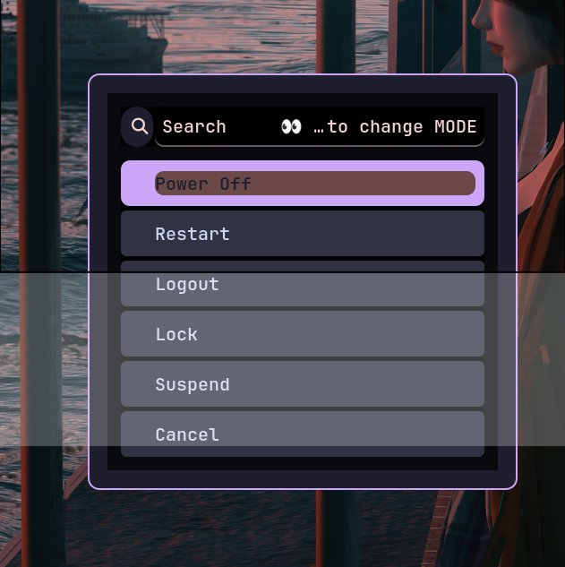

<div align="center">

# 🌙 Akashio's Debian-Hyprland Dotfiles 🐧

#### For Debian 13 (Trixie) and above — Hyprland v0.55.2

<p align="center">
  
</p>

  

<br/>
</div>

## IMPORTANT note for Hyprland 0.55.x users

> If you are coming from an older Hyprland version (0.49–0.54), some keybinds and settings in this config have changed.
> See [`CHANGELOG.md`](CHANGELOG.md) for the full list of breaking changes already patched in this config.
> Run `./install.sh` again after pulling updates — it is safe to re-run.

<div align="center">
<br>
  <a href="#-prerequisites"><kbd> <br> Read this First <br> </kbd></a>&ensp;&ensp;
  <a href="#-quick-install"><kbd> <br> Installation <br> </kbd></a>&ensp;&ensp;
  <a href="#%EF%B8%8F-gallery"><kbd> <br> Gallery <br> </kbd></a>&ensp;&ensp;
  <a href="#%EF%B8%8F-key-keybinds"><kbd> <br> Keybinds <br> </kbd></a>&ensp;&ensp;
 </div><br>

<p align="center">
  
</p>

---

## 📋 Specs

- **Compositor**: Hyprland `v0.55.4` (built from source with Lua patches)
- **Distro**: Debian (apt-based, Debian 13 "Trixie" or later recommended)
- **Config base**: [Akashio28 Hyprland-Dots](https://github.com/Akashio28), modified & adapted by [@Akashio28](https://github.com/Akashio28)
- **Config language**: Lua (`.lua`) — migrated from Hyprlang (`.conf`)
- **Plugins**: `hyprgrass`, `hyprexpo+` (via `hyprpm`)

---

### 🪧🪧🪧 ANNOUNCEMENT 🪧🪧🪧

[Full Changelog](CHANGELOG.md)

- **2026** — Migrated config to Hyprland `v0.55.4` with native Lua config
    - Migrated from Hyprlang (`.conf`) to Lua (`.lua`) — see `hyprland.lua`
    - Patched Hyprland source: dispatch fallback + global plugin keywords for Lua mode
    - Fixed `togglesplit` dispatcher (now `layoutmsg, togglesplit`)
    - Removed deprecated `dwindle:pseudotile` and `misc:vfr`
    - Replaced retired official `hyprexpo` plugin with the community fork [`sandwichfarm/hyprexpo`](https://github.com/sandwichfarm/hyprexpo) ("hyprexpo+")

---

#### ⚠️ Prerequisites and VERY Important

- Do **not** run `install.sh` with `sudo` or as `root`
- This installer requires a user with `sudo` privileges to install packages
- Debian 13 "Trixie" or greater (apt-based systems only)
- `git` must be installed: `sudo apt install -y git`

> [!IMPORTANT]
> Install a backup tool like `timeshift` or `snapper` and back up your system before running this script (**HIGHLY RECOMMENDED**).

> [!CAUTION]
> Clone this script into a directory where you have write permissions, e.g. your `HOME` directory or anywhere within it.

---

## 🖼️ Gallery

<div align="center">

| Desktop (Night wallpaper) | Desktop (Sunset wallpaper) |
| :---: | :---: |
|  |  |

| Rofi App Launcher | wlogout Power Menu |
| :---: | :---: |
|  |  |

</div>

---

## ✨ Features

- Ready-to-use Hyprland config adapted for v0.55.2 (breaking changes already patched)
- Waybar, Rofi, SwayNC, Kitty, and wlogout pre-configured
- Wallpaper management via `swww` + `wallust` color theming
- Touchscreen/trackpad gesture support (`hyprgrass`)
- Workspace overview via `hyprexpo+` (community-maintained fork)
- Automatic config backup before installing — no overwriting your old setup blindly

---

## 📁 Folder Structure

```
~/.config/hypr/
├── hyprland.lua            # Entry point (Lua) — loads UserConfigs/*.lua
├── hyprland.conf            # Stub for Python libraries (HyprMod)
├── hyprland-gui.lua         # Settings from HyprMod (GUI tool)
├── monitors.lua             # Monitor configuration
├── workspaces.lua           # Workspace rules
├── hypridle.conf            # Idle daemon config (standalone, Hyprlang)
├── hyprlock.conf            # Lockscreen config (standalone, Hyprlang)
│
├── UserConfigs/             # ⭐ Main place for customization
│   ├── UserKeybinds.lua     # Personal custom keybinds
│   ├── UserSettings.lua     # Core settings (dwindle, decoration, plugins, etc.)
│   ├── UserAnimations.lua
│   ├── UserDecorations.lua
│   ├── WindowRules.lua
│   ├── Laptops.lua / LaptopDisplay.lua
│   ├── Startup_Apps.lua     # exec-once for startup applications
│   └── ENVariables.lua      # Environment variables
│
├── animations/              # Animation presets (ML4W, HyDE, etc.)
├── scripts/                 # Bash scripts for extra features (rofi, screenshot, etc.)
├── UserScripts/             # Additional custom scripts
├── wallpaper_effects/       # Wallpaper effect cache
└── wallust/                 # Theme/colorscheme generator output
```

---

## 🔌 Plugins (via hyprpm)

| Plugin            | Repo                                                                 | Purpose                                                                                                |
| ----------------- | --------------------------------------------------------------------| ---------------------------------------------------------------------------------------------------- |
| `hyprgrass`       | [horriblename/hyprgrass](https://github.com/horriblename/hyprgrass) | Touchscreen/trackpad gestures (swipe to switch workspaces)                                            |
| `hyprexpo` (fork) | [sandwichfarm/hyprexpo](https://github.com/sandwichfarm/hyprexpo)   | Workspace overview (expo) — community fork, since the official plugin was retired as of Hyprland 0.55 |

### Install plugins manually

```bash
hyprpm add https://github.com/horriblename/hyprgrass
hyprpm add https://github.com/sandwichfarm/hyprexpo
hyprpm enable hyprgrass
hyprpm enable hyprexpo
hyprpm reload -n
```

### Update plugins (after a Hyprland update)

```bash
hyprpm update
hyprpm reload -n
```

---

## ⌨️ Key Keybinds

> Full default keybinds are in `configs/Keybinds.conf`, custom keybinds are in `UserConfigs/UserKeybinds.conf`.

> [!TIP]
> Open the in-app keybind cheat sheet anytime with `SUPER + H`.

| Keybind             | Action                          |
| ------------------- | -------------------------------- |
| `SUPER + Return`    | Open terminal                    |
| `SUPER + D`         | App launcher (rofi)              |
| `SUPER + E`         | File manager                     |
| `SUPER + Q`         | Close active window               |
| `SUPER + W`         | Select wallpaper                  |
| `SUPER + R`         | Random wallpaper                  |
| `SUPER + A`         | Workspace overview (hyprexpo+)    |
| `SUPER + SHIFT + I` | Toggle split (dwindle)            |
| `SUPER + SPACE`     | Toggle floating                   |
| `SUPER + SHIFT + F` | Fullscreen                        |
| `SUPER + N`         | Toggle night light (hyprsunset)   |
| `SUPER + H`         | Keybind cheat sheet               |
| `3-finger swipe`    | Switch workspace (hyprgrass)      |

---

## ✨ Quick Install

> [!CAUTION]
> Do **NOT** run the install script as `root` or with `sudo`. Run it as a normal user with `sudo` privileges.

Clone this repo, change directory, make executable and run the script:

```bash
git clone https://github.com/Akashio28/Debian_Hyprland_dotfilesv2.git ~/Debian_Hyprland_dotfilesv2
cd ~/Debian_Hyprland_dotfilesv2
chmod +x install.sh
./install.sh
```

#### ✨ What the script does

1. Updates your package lists (`apt update`)
2. Installs Hyprland and core dependencies via `apt`
3. Installs `hyprpm` plugin build dependencies
4. Backs up any existing `~/.config/hypr` and related app configs to `~/.config-backup-<timestamp>/`
5. Copies the dotfiles into `~/.config`
6. Installs and enables the `hyprgrass` and `hyprexpo+` plugins via `hyprpm`

#### ✨ TO DO once installation is done

- `SUPER + H` for the keybind cheat sheet
- Reload Hyprland config with `hyprctl reload`
- Reboot or log out, then select **Hyprland** from your display manager

For more detailed steps, troubleshooting, and manual/partial installation, see [`INSTALL.md`](INSTALL.md).

---

## ⚙️ Migration Notes for Hyprland 0.55.2

Breaking changes already fixed in this config:

1. **`togglesplit` dispatcher removed** since 0.54 → replaced with `layoutmsg, togglesplit`

```ini
bind = $mainMod SHIFT, I, layoutmsg, togglesplit
```

2. **`dwindle:pseudotile`** removed in 0.55 (it wasn't doing anything) → removed from `UserSettings.conf`
3. **`misc:vfr`** moved to `debug:` (not meant for production use) → removed from `UserSettings.conf`
4. **Official `hyprexpo` plugin retired** from `hyprwm/hyprland-plugins` → replaced with the [`sandwichfarm/hyprexpo`](https://github.com/sandwichfarm/hyprexpo) fork ("hyprexpo+"), which adds keyboard navigation + workspace labels.

See [`CHANGELOG.md`](CHANGELOG.md) for the full history.

---

#### 🛣️ Roadmap

- [x] Migrate config to Lua (complete — `hyprland.lua` with native Lua API)
- [ ] Add more wallpaper presets

---

#### 🙋 Having issues or questions?

- Open an issue on this repo: [Issues](https://github.com/Akashio28/Debian_Hyprland_dotfilesv2/issues)
- Refer to [`INSTALL.md`](INSTALL.md) for troubleshooting steps

---

#### 👍👍👍 Thanks and Credits

- [`Hyprland`](https://hyprland.org/) and [@vaxerski](https://github.com/vaxerski) for this awesome dynamic tiling Wayland compositor
- [`Akashio28`](https://github.com/Akashio28) for the original Hyprland-Dots this configuration is based on
- [`horriblename/hyprgrass`](https://github.com/horriblename/hyprgrass) and [`sandwichfarm/hyprexpo`](https://github.com/sandwichfarm/hyprexpo) for the plugins
- Wallpaper/illustration credits as noted in `assets/`

---

### 💖 Support

- A ⭐ on this repo would be appreciated!
- Follow [@Akashio28](https://github.com/Akashio28) on GitHub for more dotfiles and projects.

---

## 📄 License

No license specified. Feel free to use this configuration as a reference, but please credit the original [Akashio28 Hyprland-Dots](https://github.com/Akashio28) project this is based on.
